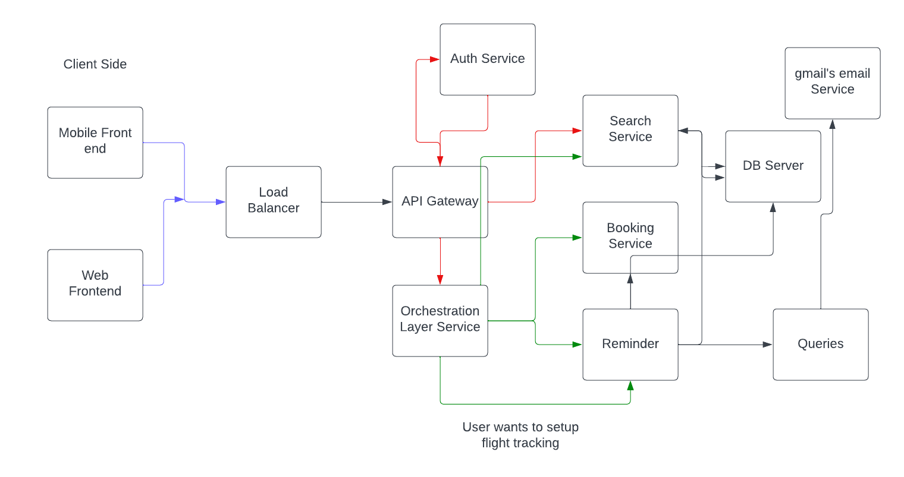

# Airline Backend System

## Objective
We need to build a backend system that can support different features for an airline company. Our end user is going to be someone who wants to book flights and query about flights, so we need a robust system to provide the best experience possible. This document focuses solely on the backend part of the system. The entire backend should be built with maintainability in mind.

---

## Requirements

### Flight Search
- A user should be able to search for flights from one place to another.
- Users should be able to mention the source and destination details.
- Users should be able to select the date of the journey.
- **[V2]** Users should be able to search for return flights and multi-city flights.
- Users should be able to select the class of the flights *(non-mandatory)*.
- Users should be able to book multiple tickets *(non-mandatory)*.
- Based on the above data, the system should list down the flights.
- Flights should be ranked based on:
  - Time period of flight
  - Price
- Support for pagination to list flights efficiently.
- Filtering options:
  - Price
  - Departure time
  - Duration
- Additional filters support.

### Booking and Payment
- A user should be able to book a flight (only if registered on the platform).
- Users should be able to cancel a booking, with refund initiation based on predefined criteria.
- Users should be able to request and book excess luggage for every flight.
- Payment system integration *(dummy payments for now)*.
- Users should be able to track flight prices and receive notifications about price drops or delays.

### User Account and Notifications
- Users should be able to view their previous and upcoming flights.
- Users should be able to download their boarding pass if they have completed online check-in.
- Online check-in should be supported.
- Email notifications:
  - Reminder to complete online check-in (3 hours before departure).
  - Alerts about any flight delays.
- Users should be able to review their flight journey *(only if they have booked a flight)*.
  - Review mechanism should include:
    - Star rating
    - Comment section
  - Flight listings should display user reviews.

### Authentication and Customer Support
- Users should be able to authenticate using email and password.
- **[V2]** Support ticketing system for user queries.
- FAQs section with static data.
- **[V2]** Seat selection feature.
- Coupons for discounts and offers.
- A single user should be able to book multiple seats with one login ID.

---

## Non-Functional Requirements
- Expect more flight searches than actual bookings.
- Booking system must be **highly accurate**.
- Traffic estimation:
  - **1,00,000 total users**
  - **5,00,000 bookings per quarter**
  - **5,000 bookings per day**
  - The system should **scale up to 3x the current estimated traffic**.
- The system should handle **real-time updates to flight prices** before finalizing a booking.
- **Concurrency should be handled using an RDBMS** for optimal performance.

---

## Capacity and Traffic Estimation

### Storage Estimation
- For the upcoming **5 years**:
  - **80,00,000 bookings**
  - **2,00,000 users**
  - Considering that all user records and booking records take **10 MB of data**, we estimate that **10 TB of storage** should be sufficient for our pilot run.

### Traffic Estimation
- With a **search:booking ratio of 30:1**, we expect a maximum of **1,50,000 search queries per day**.
- At peak times, this translates to **~2 queries per second**.

---

---

## Image Representation
  

